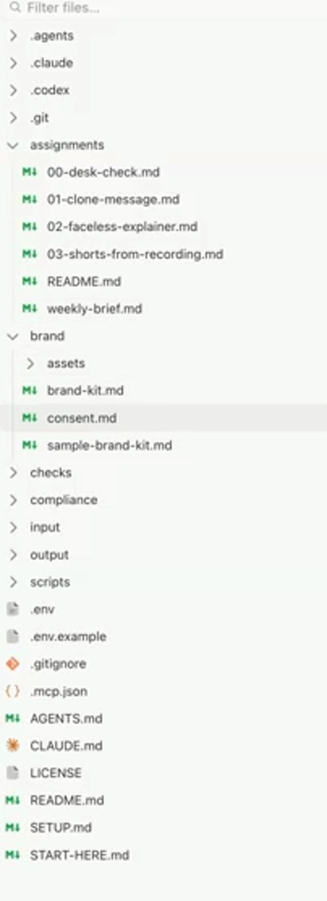
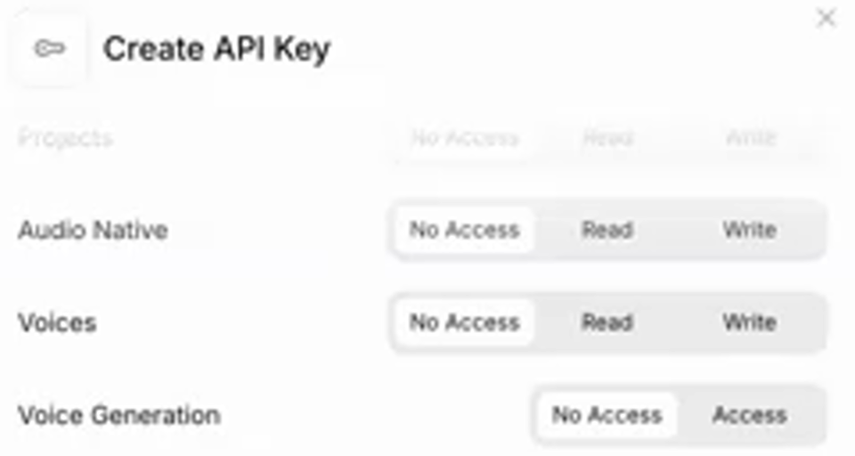
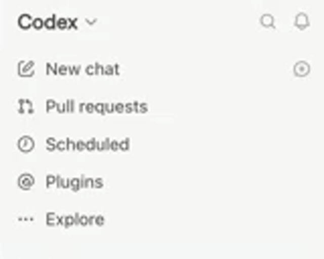

# Setup

This assumes you can open a folder as a Codex project, start a new chat, find Plugins in the sidebar, and see the file pane. If not, watch the Codex setup lesson in the separate **Build Your First Agency App** course first. That prerequisite is separate from this video-editing course.

A cloned starter folder looks like this. File names are visible; private file contents are not.



## Step 1, install the three free helpers (installation check only)

Do this whether you use Codex or Claude Code. You need Node.js 22 or newer, ffmpeg, and HyperFrames.

### Mac

Download Node.js 22 or newer from [nodejs.org](https://nodejs.org/) and run the installer. Success looks like: the installer says the installation completed successfully.

Open [brew.sh](https://brew.sh/) in your web browser and copy the Homebrew installation line shown there. Open the Terminal app on Mac, paste that line, and press Enter. When it finishes, Terminal shows a heading that says Next steps with two or three commands under it. Paste each of those commands, one at a time, and press Enter.

Then paste this line and press Enter:

```sh
brew --version
```

Success looks like: Terminal prints `Homebrew` followed by a version number.

Open the Terminal app on Mac, paste this line, and press Enter:

```sh
brew install ffmpeg
```

Success looks like: Terminal finishes without an error and shows that ffmpeg was installed.

Open the Terminal app on Mac, paste this line, and press Enter:

```sh
npm install -g hyperframes
```

Success looks like: Terminal finishes without an error and reports that a package was added or changed.

### Windows

Download Node.js 22 or newer from [nodejs.org](https://nodejs.org/) and run the installer. Success looks like: the installer says the installation completed successfully.

Open PowerShell on Windows, paste this line, and press Enter:

```powershell
winget install Gyan.FFmpeg
```

Success looks like: PowerShell says ffmpeg was successfully installed.

Open PowerShell on Windows, paste this line, and press Enter:

```powershell
npm install -g hyperframes
```

Success looks like: PowerShell finishes without an error and reports that a package was added or changed.

This is an installation check only. Run `node --version`, `ffmpeg -version`, and `hyperframes --version`. Success looks like: each prints a version number, with Node.js at 22 or newer. The desk check reports HyperFrames from the command alone. The real desk check comes after the accounts and connections are ready.

## Step 2, get the accounts

You need ChatGPT Pro 5x for Codex, HeyGen Creator, and ElevenLabs Creator. Claude Code is an equal alternative to Codex. Sign in to each account before continuing.

## Step 3, record your ElevenLabs professional voice

Record at least 5 minutes of clean audio; 30 minutes is much better. Creator includes one professional clone. Processing takes four to six hours and can take up to half a day, so submit it the day before build day. Use a quiet room and one microphone. Read naturally. In ElevenLabs, open Voices, choose Add, then choose Professional Voice Clone and follow the guide.

How you know it is ready: ElevenLabs shows the voice under My Voices with no Processing label.

Only clone your own voice. A team member must first give written consent in `brand/consent.md`.

## Step 4, make your HeyGen clone

Record a 2-minute training video. Use a plain background, keep your whole face in frame the entire time, look at the lens, and read the consent line shown on screen. HeyGen needs processing time, so do this the day before build day. Follow HeyGen's lighting and framing guide.

How you know it is ready: HeyGen shows the avatar with no Processing label and lets you preview it.

Only clone your own face. A team member must first give written consent in `brand/consent.md`.

## Step 5, create the ElevenLabs API key

In ElevenLabs, open Developers in the left sidebar, then API keys, then Create key. Tick these checkboxes:

- [ ] Text to Speech
- [ ] Speech to Text
- [ ] Sound Effects
- [ ] Music Generation (optional)

In the **Voices row, choose Read**. This is required. Keep the key private for the next step. Never paste it into chat or another shared file.



Find the Voices row and choose **Read**. This recording frame shows the control **before it is set**; No Access is not the completed setting.

## Step 6, create your private settings file

Do not use the Codex file pane for this step. Paste this prompt:

```text
Copy .env.example to .env in this folder. Do not open it, read it, or show its contents. Tell me when it exists.
```

Success: the agent says `.env` exists. Open it yourself:

- Mac: open this folder in Finder. Press Command, Shift and period together to show hidden files. Right-click `.env`, choose Open With, then TextEdit.
- Windows: open this folder in File Explorer. Under View, turn on File name extensions and Hidden items. Right-click `.env`, choose Open with, then Notepad.

Fill in this checklist in your private `.env` file, then save it. You do not need to show this file to the agent. Do not paste these values into chat.

- [ ] Required: `ELEVENLABS_API_KEY`, the private key from Step 5.
- [ ] Required: `ELEVENLABS_VOICE_ID`, your ready voice's ID. Step 8 shows where to find it.
- [ ] Required: `HEYGEN_AVATAR_ID`, your ready avatar's ID. Step 8 shows where to find it.
- [ ] Preset: `DEFAULT_OUTPUT_SIZES=16:9,9:16` for wide and vertical videos.
- [ ] Preset: `TEST_CLIP_SECONDS=10` for the short first test.

`.env` is plain text. It is safe enough for this starter because git ignores it, the agent never prints it, and the key is restricted. Keep the master copy in a password manager such as 1Password and treat `.env` as a working copy. You can make a new key in ElevenLabs and replace it at any time.

## Step 7, optional voice import

Skip this step for normal use. Only if HeyGen refuses uploaded audio, follow "Optional, import your voice into HeyGen" at the end of this guide.

## Step 8, find your IDs

In ElevenLabs, open My Voices. Copy the ID shown under your voice into `ELEVENLABS_VOICE_ID=` in `.env`.

In HeyGen, open Avatars and choose your clone. Copy the ID from the address bar or details panel into `HEYGEN_AVATAR_ID=` in `.env`.

The API key is secret. The voice ID and avatar ID are not secrets, but keep them in `.env` instead of shared files.

## Step 9, connect your agent

HeyGen signs in through the plugin. ElevenLabs speech uses the key in `.env` through the included script. The only key you paste is the ElevenLabs key. You do not need a HeyGen API key. If you made an unused HeyGen key, revoke it in HeyGen. The signed-in HeyGen connection uses plan credits; a HeyGen API key or the heygen command uses separately purchased API credits.

### Codex app



Use **Plugins** to connect a tool, then **New chat** to start a conversation that can see it.

For HeyGen: open Plugins in the Codex sidebar, search HeyGen, click + (Install); a browser page asks to connect through HeyGen MCP; Authorize access, Open ChatGPT; START A NEW CHAT; success: ask what tools you have from HeyGen and it lists them.

For HyperFrames: open Plugins, search HyperFrames, click + (Install). No sign-in. The plugin adds instructions; the hyperframes command from Step 1 does the rendering and is what the desk check tests. Start a NEW chat. Success: ask what HyperFrames skills it has.

For ElevenLabs speech, there is no required plugin. The project script uses the key from Step 6. Success: the desk check prints "ElevenLabs key works" and saves a short speech test.

### Claude Code

The folder's settings include HeyGen. If its tools are missing, run this in Terminal or PowerShell:

```sh
claude mcp add --transport http heygen https://mcp.heygen.com/mcp/v1/
```

Type `/mcp` inside Claude Code and finish sign-in. If still missing, quit and reopen the folder, then paste the first START-HERE.md prompt again. Success: HeyGen tools are listed in the new chat. ElevenLabs speech uses the project script; on Windows it is `scripts/elevenlabs-speak.ps1`.

> **Optional extra, sound effects and music only**
>
> In Codex Plugins, choose Add custom, paste `https://api.elevenlabs.io/v1/mcp`, choose OAuth, Save, then Authorize. START A NEW CHAT after sign-in. In Claude Code, the optional ElevenLabs connection is listed in the folder settings; use `/mcp` to sign in. Use these extras only when the ElevenLabs tool is listed in this chat. Speech always uses the included script. If an extra is unavailable, the agent skips it and notes that in the draft README.

## Step 10, run the desk check

START A NEW CHAT and paste:

```text
Read AGENTS.md. Then run the desk check and tell me in plain English what is connected and what is not. Do not make any video yet.
```

The agent runs `bash scripts/check-setup.sh` on Mac or `scripts/check-setup.ps1` on Windows. It checks helpers and the live key without showing private values. After connecting a plugin or changing `.env`, START A NEW CHAT and paste that same prompt again.

> **If something does not connect**
>
> - Not signed in: reopen the plugin and finish sign-in, then START A NEW CHAT and paste the first prompt from START-HERE.md again. In Claude Code, use `/mcp`, finish sign-in; if still missing, quit and reopen the folder and paste the prompt again.
> - Wrong plan: confirm that HeyGen and ElevenLabs show the Creator plan.
> - Key not restricted correctly: under Developers, API keys, make a new key using the Step 5 checkbox list (Text to Speech, Speech to Text, Sound Effects, Music Generation optional) and set Voices to Read.

## Optional, import your voice into HeyGen (only if HeyGen refuses uploaded audio)

In HeyGen, open Settings, Voices, then Import third-party voice. Paste the restricted ElevenLabs key there, choose Manage, then choose your professional voice. Do not paste the key into chat. This gives HeyGen the key's permissions: Text to Speech, Speech to Text, Sound Effects, Music Generation if selected, and Voices set to Read. You can revoke it and make a new one in ElevenLabs under Developers, API keys. Normal use uploads the script's narration and needs no import.
